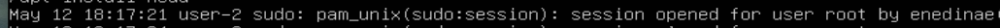

# Операционные системы UNIX/Linux (Базовый).

Установка и обновления системы Linux. Основы администрирования.

## Contents
1. [Задание 1](#задание-1)
2. [Задание 2](#задание-2)
3. [Задание 3](#задание-3)
4. [Задание 4](#задание-4)
5. [Задание 5](#задание-5)
6. [Задание 6](#задание-6)
7. [Задание 7](#задание-7)
8. [Задание 8](#задание-8)
9. [Задание 9](#задание-9)
10. [Задание 10](#задание-10)
11. [Задание 11](#задание-11)
12. [Задание 12](#задание-12)
13. [Задание 13](#задание-13)
14. [Задание 14](#задание-14)
15. [Задание 15](#задание-15)

## Задание 1
+ Скачиваем VirtualBox и образ iso для ubuntu-server

    Проходим базовую конфигурацию виртуальной машины, создаем пользователя и все готово!

+ Выполняем команду cat /etc/issue

    |  |
    |:--:|
    | *скрин поставленной версии* |

## Задание 2
+ создаем нового пользователя добавляя его в группу adm

    |  |
    |:--:|
    | *команда добавления пользователя* |
+ проверим наличие пользователя

    |  |
    |:--:|
    | *вывод команды cat /etc/passwd* |

## Задание 3
+ задаем имя машины изменив содержимое файла /etc/hostname на user-1

    |  |
    |:--:|
    | *вывод команды hostname* |
+ установим временную зону для Москвы

    |  |
    |:--:|
    | *вывод команды date* |
+ выведем список сетевых интерфейсов

    |  |
    |:--:|
    | *сетевые интерфейсы нашей системы* |

    lo - Это локальный интерфейс, который позволяет программам обращаться к этому компьютеру
    
    enp0s3 - Сетевой интерфейс проводного интернета Ethernet
+ получаем ip адрес от DHCP сервера

    |  |
    |:--:|
    | *ip адрес полученный от DHCP* |

    DHCP - Dynamic Host Configuration Protocol (протокол автоматизации назначения IP-адреса клиенту)
+ Выводим ip и gateway по умолчанию

    |  |
    |:--:|
    | *вывод команды ip route* |
+ Чтобы задать статичные настройки (ip, gw, dns) нужно поменять конфигурацию файла /etc/netplan/00-installer-config.yaml Отключаем динамическое получение ip и пишем свои настройки

    |  |
    |:--:|
    | *статические настройки* |
+ Применим изменения и перезагрузим машину, посмотрим изменились ли ip и пропингуем 1.1.1.1 и ya.ru

    |  |
    |:--:|
    | *настройки поменялись* |

    |  |
    |:--:|
    | *пингуем ya.ru* |

    |  |
    |:--:|
    | *пингуем 1.1.1.1* |

## Задание 4
+ Обновляем все пакеты командой sudo apt full-upgrade

    |  |
    |:--:|
    | *Обновлений больше нет* |

## Задание 5
+ Назначение команды для администрирования sudo - выполнять команды от имени других пользователей (чаще всего от суперпользователя)

+ Для того чтобы созданный юзер мог выполнять команду sudo, его надо добавить в группу sudo

    |  |
    |:--:|
    | *добавление пользователя в группу sudo* |

+ Теперь от его имени можно поменять hostname

    |  |
    |:--:|
    | *редактируем файл от имени другого пользователя* |

    |  |
    |:--:|
    | *новый hostname* |

## Задание 6
+ Служба автоматической синхронизации времени была настроена еще в 3 шаге

    |  |
    |:--:|
    | *Вывод часового пояса* |

    |  |
    |:--:|
    | *Вывод команды timedatectl show* |

## Задание 7
+ Были установлены редакторы: VIM, Nano, Joe

+ ### VIM
    + Для выхода с сохранением **:wq**

        |  |
        |:--:|
        | *Содержимое перед закрытием* |
    + Для выхода без сохранения **:q!**

        |  |
        |:--:|
        | *Содержимое после редактирования* |
    + Для поиска с заменой всех вхождений **:%s/<то что ищем>/<замена>/g**

        |  |
        |:--:|
        | *Команда для поиска с заменой* |

        |  |
        |:--:|
        | *Содержимое после команды* |

+ ### Joe
    + Для выхода с сохранением **ctrl K** затем **X**

        |  |
        |:--:|
        | *Содержимое перед закрытием* |
    + Для выхода без сохранения **ctrl K** затем **Q** и не сохранять изменения

        |  |
        |:--:|
        | *Содержимое после редактирования* |
    + Для поиска с заменой всех вхождений **ctrl G** затем **R**
        |  |
        |:--:|
        | *Команда для поиска* |

        |  |
        |:--:|
        | *Команда для замены* |

        |  |
        |:--:|
        | *Содержимое после команды* |

+ ### Nano
    + Для выхода с сохранением **ctrl X** и соглашаемся сохранить изменения

        |  |
        |:--:|
        | *Содержимое перед закрытием* |
    + Для выхода без сохранения **ctrl X** и не соглашаемся сохранить изменения
        |  |
        |:--:|
        | *Содержимое после редактирования* |
    + Для поиска с заменой всех вхождений **ctrl W** затем **ctrl R**
        |  |
        |:--:|
        | *Команда для поиска* |

        |  |
        |:--:|
        | *Команда для замены* |

        |  |
        |:--:|
        | *Содержимое после команды* |

## Задание 8
+ Для установки SSHd введем **sudo apt install openssh-server**

+ Чтобы добавить автостарт службы при загрузке системы введем **sudo systemctl enable ssh**

+ Для переназначения порта изменим порт в файле /etc/ssh/sshd_config на 2022 и разкомментим его

+ Используем команду ps с ключами -ef для того чтобы увидеть подробную информацию по всем процессам и отберем только sshd

    |  |
    |:--:|
    | *вывод процессов sshd* |

+ Перезапустим и введем команду **netstat -tan**

    |  |
    |:--:|
    | *вывод команды* |

    ключи:

    + -ta Комбинация выводит список всех tcp портов (как прослушиваемых, так и нет)
    + -n Отображает адреса и номера портов в числовом формате

    Столбцы:

    + Proto – протокол
    + Recv-Q – количество байтов, помещённых в буфер приёма TCP/IP, но не переданных приложению
    + Send-Q – количество байтов, помещённых в буфер отправки TCP/IP, но не отправленных, или отправленных, но не подтверждённых
    + Local Address – локальный адрес сервера. Так 0.0.0.0:port – значит подключаться можно ко всем адресам сервера
    + Foreign Address – адрес второй стороны. Так 0.0.0.0:* – значит подключаться можно с любых адресов и с любых портов
    + State – состояние подключения, или прослушивания

## Задание 9
+ Запустим команду top

    |  |
    |:--:|
    | *вывод команды* |

    Что мы можем узнать из этого вывода?

    + uptime - 15:56:13 up 1:25 min
    + количество авторизованных пользователей - 1 user
    + общую загрузку системы - 0.0 (0%)
    + общее количество процессов - 97
    + загрузку cpu - (0.0% системные процессы) (99.7% процент времени, когда ЦПУ не был загружен)
    + загрузку памяти 214.3 Mb
    + pid процесса занимающего больше всего памяти - 1293
    
        |  |
        |:--:|
        | *Shift+M, чтобы отсортировать вывод команды top по памяти* |
    
    + pid процесса, занимающего больше всего процессорного времени - 671
    
        |  |
        |:--:|
        | *Shift+F, чтобы войти в интерактивный режим и выбрать поле TIME+* |

+ Запустим команду htop

    + сортировка по PID, PERCENT_CPU, PERCENT_MEM, TIME
        |  |
        |:--:|
        | *Sort_by PID* |
        |  |
        | *Sort_by PERCENT_CPU* |
        |  |
        | *Sort_by PERCENT_MEM* |
        |  |
        | *Sort_by TIME* |
    + фильтрация для процесса sshd
        |  |
        |:--:|
        | *Фильтрация sshd* |
    + процесс syslog, найденный, используя поиск
        |  |
        |:--:|
        | *поиск по syslog* |
    + добавим вывод hostname, clock и uptime
        |  |
        |:--:|
        | *Вывод основной информации системы* |

## Задание 10
+ Запустим команду fdisk -l
    |  |
    |:--:|
    | *Вывод информации по диску* |

    + название жесткого диска - /dev/sda
    + размер - 30G
    + количество секторов - 63393664
    + размер swap - 2.9G
        |  |
        |:--:|
        | *размер swap* |

## Задание 11
+ Запустим команду df -h (размер без флага -h в килобайтах)
    |  |
    |:--:|
    | *Вывод команды df* |
    
    Для корневого раздела(/):
    + размер раздела - 14G
    + размер занятого пространства - 5.5G
    + размер свободного пространства - 7.7G
    + процент использования - 42%

+ Запустим команду df -Th
    |  |
    |:--:|
    | *Вывод команды df* |
    
    Для корневого раздела(/):
    + размер раздела - 14G
    + размер занятого пространства - 5.5G
    + размер свободного пространства - 7.7G
    + процент использования - 42%
    + тип файловой системы - ext4

## Задание 12
+ Выведем размер папок /home, /var, /var/log и всего содержимого в /var/log
    |  |
    |:--:|
    | *вывод команды du* |
    |  |
    | *размер /home* |
    |  |
    | *размер /var* |
    |  |
    | *размер /var/log* |
    |  |
    | *размер всего содержимого в /var/log* |

## Задание 13
+ Установим ncdu и выведем размер папок из прошлого задания
    | _ _  |
    |:--:|
    | *вывод размера папок с помощью команды ncdu* |

## Задание 14
+ Для того чтобы посмотреть время последней успешной авторизации, имя пользователя и метод входа в систему, нужно открыть файл /var/log/auth.log
    |  |
    |:--:|
    | *логи авторизации* |

    Видим время, имя пользователя и метод входа в систему (by enedinae)

+ Перезапускаем службу sshd командой **sudo systemctl restart ssh** и находим информацию о перезапуске в файле /var/log/syslog
    |  |
    |:--:|
    | *логи syslog* |

    Также информацию о перезапуске можно найти в логах авторизации
    |  |
    |:--:|
    | *логи авторизации* |

## Задание 15
+ Задаем для планировщика выполнение скрипта и ждем пару минут, затем смотрим выполнилось ли в логах /var/log/syslog
    |  |
    |:--:|
    | *логи syslog* |

+ посмотрим список текущих задач для CRON
    |  |
    |:--:|
    | *список задач* |

+ удалим все задачи и посмотрим на список снова
    |  |
    |:--:|
    | *список задач* |